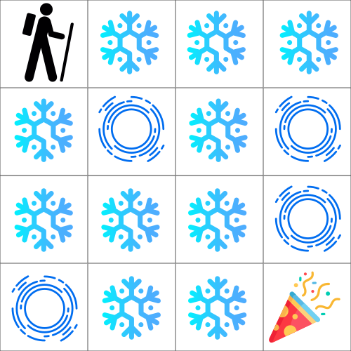

# Tutorial session

## Outline

1. Installation & setting everything up
2. A bandit exploration problem
3. Q-Learning 
4. What's next ideas

## 1. Installation

Clone the github repo:
```shell
git clone https://github.com/...
```

Create a virtual environment
```shell
python3.9 -m venv PATH_TO_REPO/venv
source PATH_TO_REPO/venv/bin/activate
pip install -r PATH_TO_REPO/requirements.txt
```

## 2. A bandit exploration problem

In this excersise you will experiment with the multi-armed bandit algorithm using different exploration/exploitation strategies:


You will be guided through the already implemented code for Greedy and Epsilon-greedy strategies, and are expected to extend the code to include Softmax and UCB. You will be able to experiment with different parameters and observe the performance of each estrategy.

In the directory `bandits` you will find the files:
- `agents.py`: The file you need to complete to include Softmax and UCB strategies. 
- `runner.py`: The training loop for a single run is already implemented, as well as a method to run multiple experiments and obtain meaningful statistics about each strategy behaviour. You can use the function: `plot_experiment` to visualize the average over different experiments of the rewards obtained during training (as well as the total acumulated reward per timestep).
- `env.py`: The file that handdles the evrionment with which the agent will interact. You don't have to do anything here. You can choose between three environments using the parameter `difficulty`, use 0 for `Easy`, 1 for `Medium` and 2 for `Hard`.


### Your part

To complete this exercise, we expect you to write the functions in the `bandit` folder. You need to create two classes that inherit from `BaseAgent` and modify the methods to perform the respective exploration strategy. Take inspiration from the code that is already implemented. After completing the code, run it and train the agents. You can play around with the different parameters for the agents:

- `epsilon` for the epsilon greedy approach.
- `tau` the temperature of the softmax approach.
- `c` for the UCB approach.

Finally, present a plot for each of the strategies you have implemented, where you compare at least three combinations of the respective parameters.

## 3. Q-Learning


For this exercise, you will have to implement a Reinforcement Learning agent that plays the *Frozen Lake* game. We use the implementation of the FrozenLake environment from OpenAI's Gym, where it is described as follows:

     Winter is here. You and your friends were tossing around a frisbee at the
    park when you made a wild throw that left the frisbee out in the middle of
    the lake. The water is mostly frozen, but there are a few holes where the
    ice has melted. If you step into one of those holes, you'll fall into the
    freezing water. At this time, there's an international frisbee shortage, so
    it's absolutely imperative that you navigate across the lake and retrieve
    the disc. However, the ice is slippery, so you won't always move in the
    direction you intend.
    The surface is described using a grid like the following

        SFFF
        FHFH
        FFFH
        HFFG

    S : starting point, safe
    F : frozen surface, safe
    H : hole, fall to your doom
    G : goal, where the frisbee is located

    The episode ends when you reach the goal or fall in a hole.
    You receive a reward of 1 if you reach the goal, and zero otherwise.

The agent can move in the 4 directions (0: LEFT; 1: DOWN; 2: RIGHT; 3: UP). However due to the wind and the snow the agent has a hard time moving and so the action has only a probability of 1/3 to succeed! With probability 2/3 the agent will move in one of the two 'perpendicular' directions (1/3 each). The agent is initially not aware know the randomness of the environment: it needs to discover this by interaction.

To give you an example, if your agent selects the 'LEFT' action as the environment is also stochastic, there is a 33% chance of actually going left, a 33% chance of going up, and a 33% chance of going down. There is 0% chance of going in the reverse direction, in this case RIGHT. If you run into a wall, you stay in the same place.



In the directory `q_learning` you will find two files: 
- `agents.py`: This files contains the skeleton for a Q-Learning implementation. We will ask you to complete this implementation.
- `runner.py`: This files contanis the training loop for Q-Learning. We ask you to add code to create the plots here, and running `python runner.py` should train an agent.

### Exploration

You start off with a completely random agent which will only explore its environment, and learn from its interactions with it. After a while, the agent learns that certain actions in certain states are better than others. The exploration rate decreases over time, to allow the agent to gradually exploit the learned policy more often, until it converges to a policy that approximately maximizes the expected return. Keep in mind that the stochasticity of the environment might lead to a policy that does not always succeed.

`epsilon = max(epsilon * decay_rate, epsilon_min)`

### Your part

For this exercise, we ask you to complete the functions in the `frozen_lake` folder. A large part of the code has already been set up, you mostly have to complete the agent parts. After completing the code, run it and train an agent that performs well. Give your approach `30 000` episodes to converge. Fine-tune your hyperparameters:the learning rate, your exploration parameters `(epsilon_max, epsilon_min, epsilon_decay)` and the number of total episodes. You can set a discount factor of `0.99`. 

The policy should be evaluated over `32` evaluation episodes every `1000` training episodes. A plot containing the return of the agent during training and the return at all evaluation times should be included in the report. This plot should be averaged over `10` full training runs with standard deviations as error bars.

After that, you ask you to write code that lets you inspect a trained policy in human-readable form (e.g., a grid world with arrows)

## 4. What's next

As discussed during the lecture, the Q-learning approach we studied here is a tabular version, which can only be used for environments of limited complexity. To deal with environments that consider large state and action spaces (for example to solve Atari games), deep reinforcement learning approachs are necessary. This falls beyond the scope of this tutorial, but we refer to this tutorial [1]. For further reference to reinforcement learning approachs and environments, we refer to ClearRL [2], which provides clear implementations for many popular reinforcement learning approachs.

[1] [PyTorch Tutorials](https://pytorch.org/tutorials/intermediate/reinforcement_q_learning.html)

[2] [ClearRL](https://docs.cleanrl.dev/)
